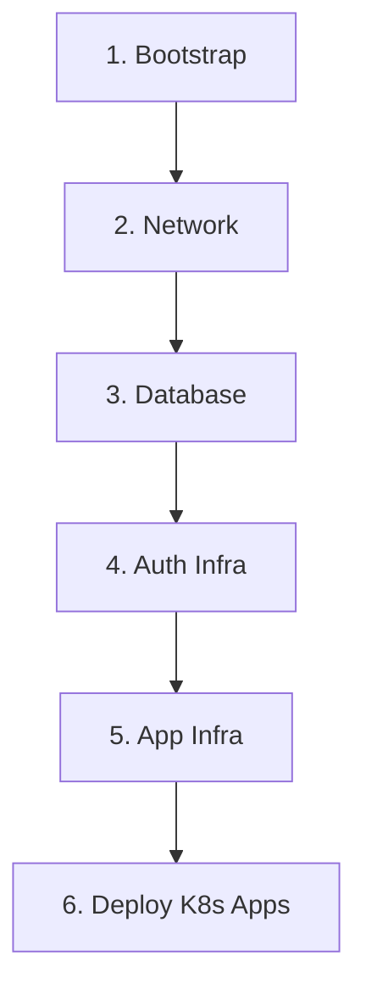

# 🏗️ OficinaPro - Infraestrutura e DevOps

[](https://www.terraform.io/)
[](https://aws.amazon.com/)
[](LICENSE)

## 📋 Descrição

Este repositório centraliza toda a **Infrastructure as Code (IaC)** do projeto OficinaPro, utilizando Terraform para provisionar e gerenciar recursos na AWS. A infraestrutura suporta uma arquitetura de microserviços com autenticação serverless e aplicações containerizadas em Kubernetes.

## 🎯 Propósito

- Provisionar infraestrutura completa na AWS de forma automatizada
- Garantir reprodutibilidade e versionamento da infraestrutura
- Separar responsabilidades em módulos independentes (network, database, app, auth)
- Facilitar o deploy e a manutenção através de pipelines CI/CD

## 🛠️ Tecnologias Utilizadas

| Tecnologia | Versão | Descrição |
|------------|--------|-----------|
| **Terraform** | >= 1.5 | Infrastructure as Code |
| **AWS Provider** | ~> 5.0 | Provider para recursos AWS |
| **GitHub Actions** | - | CI/CD Pipelines |
| **AWS S3** | - | Backend remoto do Terraform |
| **AWS DynamoDB** | - | Lock de estado do Terraform |

### Serviços AWS Provisionados

| Serviço | Uso |
|---------|-----|
| **VPC** | Rede virtual isolada |
| **Subnets** | Públicas e privadas (multi-AZ) |
| **NAT Gateway** | Saída de internet para subnets privadas |
| **Internet Gateway** | Conectividade pública |
| **EC2** | Instância K3s (Kubernetes leve) |
| **ALB** | Load Balancer para aplicação |
| **RDS PostgreSQL** | Banco de dados relacional |
| **Lambda** | Funções serverless (autenticação) |
| **API Gateway** | Gateway para APIs HTTP |
| **CloudWatch** | Logs e métricas |
| **Secrets Manager** | Gestão de segredos |
| **IAM** | Roles e políticas de acesso |

## 📁 Estrutura do Repositório

```
OficinaPro-DevOps/
├── bootstrap/              # Backend remoto (S3 + DynamoDB)
│   ├── main.tf
│   ├── backend.tf
│   └── variables.tf
├── network/                # Infraestrutura de rede (VPC, Subnets, IGW, NAT)
│   ├── main.tf
│   ├── backend.tf
│   ├── outputs.tf
│   └── variables.tf
├── auth-infra/             # Infraestrutura de autenticação (Lambda + API GW)
│   ├── main.tf
│   ├── backend.tf
│   └── variables.tf
├── app-infra/              # Infraestrutura da aplicação (EC2, ALB, K3s)
│   ├── main.tf
│   ├── backend.tf
│   ├── outputs.tf
│   ├── variables.tf
│   └── scripts/
│       └── user_data.sh.tpl
└── README.md
```

## 🏗️ Arquitetura da Infraestrutura

```
┌─────────────────────────────────────────────────────────────────────────────┐
│                              AWS CLOUD                                       │
│  ┌───────────────────────────────────────────────────────────────────────┐  │
│  │                         VPC (10.0.0.0/16)                              │  │
│  │                                                                        │  │
│  │  ┌─────────────────────┐    ┌─────────────────────┐                   │  │
│  │  │   Public Subnet 1   │    │   Public Subnet 2   │                   │  │
│  │  │   (10.0.1.0/24)     │    │   (10.0.2.0/24)     │                   │  │
│  │  │                     │    │                     │                   │  │
│  │  │  ┌───────────────┐  │    │  ┌───────────────┐  │                   │  │
│  │  │  │   NAT Gateway │  │    │  │      ALB      │  │                   │  │
│  │  │  └───────────────┘  │    │  └───────────────┘  │                   │  │
│  │  │                     │    │         │           │                   │  │
│  │  │  ┌───────────────┐  │    │         ▼           │                   │  │
│  │  │  │  EC2 (K3s)    │◀─┼────┼─────────┘           │                   │  │
│  │  │  │  Kubernetes   │  │    │                     │                   │  │
│  │  │  └───────────────┘  │    │                     │                   │  │
│  │  └─────────────────────┘    └─────────────────────┘                   │  │
│  │                                                                        │  │
│  │  ┌─────────────────────┐    ┌─────────────────────┐                   │  │
│  │  │  Private Subnet 1   │    │  Private Subnet 2   │                   │  │
│  │  │  (10.0.3.0/24)      │    │  (10.0.4.0/24)      │                   │  │
│  │  │                     │    │                     │                   │  │
│  │  │  ┌───────────────┐  │    │  ┌───────────────┐  │                   │  │
│  │  │  │     RDS       │  │    │  │    Lambda     │  │                   │  │
│  │  │  │  PostgreSQL   │  │    │  │ (Auth Gateway)│  │                   │  │
│  │  │  └───────────────┘  │    │  └───────────────┘  │                   │  │
│  │  └─────────────────────┘    └─────────────────────┘                   │  │
│  │                                                                        │  │
│  └───────────────────────────────────────────────────────────────────────┘  │
│                                                                              │
│  ┌───────────────────────────────────────────────────────────────────────┐  │
│  │                         SERVIÇOS EXTERNOS                              │  │
│  │  ┌───────────────┐  ┌───────────────┐  ┌───────────────┐              │  │
│  │  │  API Gateway  │  │  CloudWatch   │  │ Secrets Mgr   │              │  │
│  │  └───────────────┘  └───────────────┘  └───────────────┘              │  │
│  └───────────────────────────────────────────────────────────────────────┘  │
└─────────────────────────────────────────────────────────────────────────────┘
```

## 🚀 Passos para Execução e Deploy

### Pré-requisitos

- [Terraform](https://www.terraform.io/downloads.html) >= 1.5
- [AWS CLI](https://aws.amazon.com/cli/) configurado com credenciais
- Conta AWS com permissões adequadas
- Par de chaves SSH (para acesso à EC2)

### Variáveis de Ambiente Necessárias

```bash
export AWS_ACCESS_KEY_ID="sua-access-key"
export AWS_SECRET_ACCESS_KEY="sua-secret-key"
export AWS_REGION="us-east-1"
export TF_VAR_ssh_public_key="ssh-rsa AAAAB3..."
export TF_VAR_db_password="senha-segura-do-banco"
```

### 1. Bootstrap (Executar apenas uma vez)

Cria o bucket S3 e tabela DynamoDB para o backend remoto do Terraform.

```bash
cd bootstrap/
terraform init
terraform apply
```

### 2. Network (Rede)

Provisiona VPC, Subnets, Internet Gateway e NAT Gateway.

```bash
cd ../network/
terraform init
terraform apply
```

### 3. Database (Banco de Dados)

Provisiona o RDS PostgreSQL (ver repositório `OficinaPro-Database`).

### 4. Auth Infrastructure

Provisiona Lambda e API Gateway para autenticação.

```bash
cd ../auth-infra/
terraform init
terraform apply
```

### 5. App Infrastructure

Provisiona EC2, ALB e configura K3s.

```bash
cd ../app-infra/
terraform init
terraform apply
```

### Deploy via GitHub Actions

Os workflows estão configurados para execução manual (`workflow_dispatch`):

1. **Bootstrap Infra Backend** - Executar primeiro (uma única vez)
2. **Network Infra CI/CD** - Criar/destruir rede
3. **App Infra CI/CD** - Criar/destruir aplicação
4. **Auth Infra CI/CD** - Criar/destruir autenticação

## 📊 Outputs Importantes

### Network

| Output | Descrição |
|--------|-----------|
| `vpc_id` | ID da VPC criada |
| `public_subnet_ids` | IDs das subnets públicas |
| `private_subnet_ids` | IDs das subnets privadas |

### App Infrastructure

| Output | Descrição |
|--------|-----------|
| `alb_dns_name` | DNS do Application Load Balancer |
| `ec2_public_ip` | IP público da instância EC2 |
| `k3s_kubeconfig` | Configuração do Kubernetes |

### Auth Infrastructure

| Output | Descrição |
|--------|-----------|
| `api_gateway_url` | URL do API Gateway |
| `lambda_function_name` | Nome da função Lambda |

## 🔐 Segurança

- **Security Groups**: Configurados com princípio do menor privilégio
- **IAM Roles**: Roles específicas para cada serviço
- **Secrets Manager**: Gestão segura de credenciais
- **VPC**: Isolamento de rede com subnets públicas e privadas
- **HTTPS**: Tráfego criptografado via ALB

## 📚 Documentação Relacionada

| Documento | Descrição |
|-----------|-----------|
| [Arquitetura Geral](../core-domain-service/docs/ARCHITECTURE.md) | Visão geral da arquitetura |
| [Database](../OficinaPro-Database/README.md) | Infraestrutura do banco |
| [Auth Service](../auth-oficinapro/README.md) | Serviço de autenticação |
| [Core Service](../core-domain-service/README.md) | Serviço principal |
| [Payments](../OficinaPro-Payments/README.md) | Serviço de pagamentos |

## 🔄 Ordem de Deploy



## 💰 Custos

A infraestrutura foi projetada para **AWS Free Tier**:

| Recurso | Free Tier |
|---------|-----------|
| EC2 t2.micro | 750 horas/mês |
| RDS db.t3.micro | 750 horas/mês |
| Lambda | 1M requests/mês |
| API Gateway | 1M requests/mês |
| S3 | 5GB |
| CloudWatch | 10 métricas customizadas |

## 👥 Equipe

Desenvolvido para o **Tech Challenge da FIAP**.

---

**Status**: ✅ Produção Ready
**Última atualização**: Janeiro de 2026
