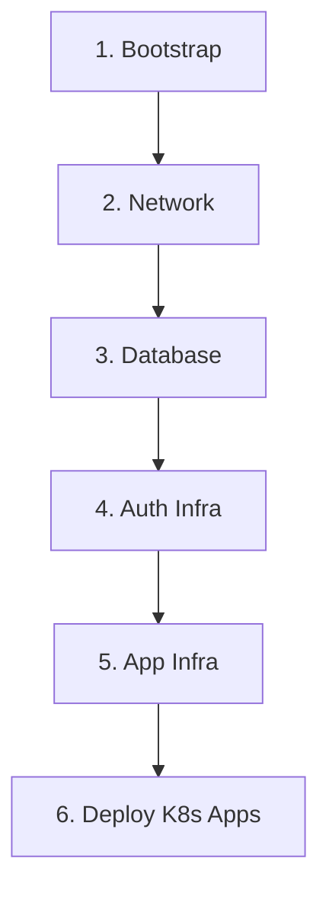

# 🏗️ OficinaPro - Infraestrutura e DevOps

[](https://www.terraform.io/)
[](https://aws.amazon.com/)
[](LICENSE)

## 📋 Descrição

Este repositório centraliza toda a **Infrastructure as Code (IaC)** do projeto OficinaPro, utilizando Terraform para provisionar e gerenciar recursos na AWS. A infraestrutura suporta uma arquitetura de microserviços com autenticação serverless e aplicações containerizadas em Kubernetes.

## 🎯 Propósito

- Provisionar infraestrutura completa na AWS de forma automatizada
- Garantir reprodutibilidade e versionamento da infraestrutura
- Separar responsabilidades em módulos independentes (network, database, app, auth)
- Facilitar o deploy e a manutenção através de pipelines CI/CD

## 🛠️ Tecnologias Utilizadas

| Tecnologia | Versão | Descrição |
|------------|--------|-----------|
| **Terraform** | >= 1.5 | Infrastructure as Code |
| **AWS Provider** | ~> 5.0 | Provider para recursos AWS |
| **GitHub Actions** | - | CI/CD Pipelines |
| **AWS S3** | - | Backend remoto do Terraform |
| **AWS DynamoDB** | - | Lock de estado do Terraform |

### Serviços AWS Provisionados

| Serviço | Uso |
|---------|-----|
| **VPC** | Rede virtual isolada |
| **Subnets** | Públicas e privadas (multi-AZ) |
| **NAT Gateway** | Saída de internet para subnets privadas |
| **Internet Gateway** | Conectividade pública |
| **EC2** | Instância K3s (Kubernetes leve) |
| **ALB** | Load Balancer para aplicação |
| **RDS PostgreSQL** | Banco de dados relacional |
| **Lambda** | Funções serverless (autenticação) |
| **API Gateway** | Gateway para APIs HTTP |
| **CloudWatch** | Logs e métricas |
| **Secrets Manager** | Gestão de segredos |
| **IAM** | Roles e políticas de acesso |

## 📁 Estrutura do Repositório

```
OficinaPro-DevOps/
├── bootstrap/              # Backend remoto (S3 + DynamoDB)
│   ├── main.tf
│   ├── backend.tf
│   └── variables.tf
├── network/                # Infraestrutura de rede (VPC, Subnets, IGW, NAT)
│   ├── main.tf
│   ├── backend.tf
│   ├── outputs.tf
│   └── variables.tf
├── auth-infra/             # Infraestrutura de autenticação (Lambda + API GW)
│   ├── main.tf
│   ├── backend.tf
│   └── variables.tf
├── app-infra/              # Infraestrutura da aplicação (EC2, ALB, K3s)
│   ├── main.tf
│   ├── backend.tf
│   ├── outputs.tf
│   ├── variables.tf
│   └── scripts/
│       └── user_data.sh.tpl
└── README.md
```

## 🏗️ Arquitetura da Infraestrutura (Fase 4 - Produção)

### Cluster K3s Multi-Node (2 Nodes)

```
┌────────────────────────────────────────────────────────────────────────────────────┐
│                                   AWS CLOUD                                         │
│  ┌──────────────────────────────────────────────────────────────────────────────┐  │
│  │                            VPC (10.0.0.0/16)                                  │  │
│  │                                                                               │  │
│  │  ┌────────────────────────────┐    ┌────────────────────────────┐            │  │
│  │  │    Public Subnet 1 (AZ-A)  │    │    Public Subnet 2 (AZ-B)  │            │  │
│  │  │      (10.0.1.0/24)         │    │      (10.0.2.0/24)         │            │  │
│  │  │                            │    │                            │            │  │
│  │  │  ┌──────────────────────┐  │    │  ┌──────────────────────┐  │            │  │
│  │  │  │  K3s Master Node     │  │    │  │  K3s Worker Node     │  │            │  │
│  │  │  │  ─────────────────   │  │    │  │  ─────────────────   │  │            │  │
│  │  │  │  Type: t3.small      │  │    │  │  Type: m7i-flex.large│  │            │  │
│  │  │  │  RAM:  2GB           │  │    │  │  RAM:  8GB           │  │            │  │
│  │  │  │  Role: control-plane │  │    │  │  Role: worker        │  │            │  │
│  │  │  │  IP:   54.147.109.116│  │    │  │  IP:   34.197.144.129│  │            │  │
│  │  │  │                      │  │    │  │                      │  │            │  │
│  │  │  │  🎯 Control Plane    │◀─┼────┼──│  🚀 Workloads        │  │            │  │
│  │  │  │  • API Server        │  │    │  │  • 7 Microservices   │  │            │  │
│  │  │  │  • Scheduler         │  │    │  │  • Java/Python/Go    │  │            │  │
│  │  │  │  • Controller Mgr    │  │    │  │  • High Memory Pool  │  │            │  │
│  │  │  └──────────────────────┘  │    │  └──────────────────────┘  │            │  │
│  │  │           │                │    │           │                │            │  │
│  │  │           └────────────────┼────┼───────────┘                │            │  │
│  │  │                   ▼        │    │                            │            │  │
│  │  │        ┌──────────────────┐│    │                            │            │  │
│  │  │        │Internal ALB      ││    │                            │            │  │
│  │  │        │(VPC Link)        ││    │                            │            │  │
│  │  │        └──────────────────┘│    │                            │            │  │
│  │  └────────────────────────────┘    └────────────────────────────┘            │  │
│  │                                                                               │  │
│  │  ┌────────────────────────────┐    ┌────────────────────────────┐            │  │
│  │  │   Private Subnet 1 (AZ-A)  │    │   Private Subnet 2 (AZ-B)  │            │  │
│  │  │     (10.0.3.0/24)          │    │     (10.0.4.0/24)          │            │  │
│  │  │                            │    │                            │            │  │
│  │  │  ┌──────────────────────┐  │    │  ┌──────────────────────┐  │            │  │
│  │  │  │  RDS PostgreSQL      │  │    │  │  Lambda Functions    │  │            │  │
│  │  │  │  ──────────────────  │  │    │  │  ──────────────────  │  │            │  │
│  │  │  │  Multi-AZ: Enabled   │  │    │  │  • Auth Gateway      │  │            │  │
│  │  │  │  Backup: Automated   │  │    │  │  • Order Handler     │  │            │  │
│  │  │  └──────────────────────┘  │    │  └──────────────────────┘  │            │  │
│  │  └────────────────────────────┘    └────────────────────────────┘            │  │
│  │                                                                               │  │
│  └──────────────────────────────────────────────────────────────────────────────┘  │
│                                                                                     │
│  ┌──────────────────────────────────────────────────────────────────────────────┐  │
│  │                            SERVIÇOS GERENCIADOS                               │  │
│  │  ┌─────────────┐  ┌─────────────┐  ┌──────────────┐  ┌─────────────┐        │  │
│  │  │API Gateway  │  │ CloudWatch  │  │Secrets Mgr   │  │  ECR        │        │  │
│  │  │(REST/HTTP)  │  │  Logs/Métr. │  │(Credentials) │  │ (Imagens)   │        │  │
│  │  └─────────────┘  └─────────────┘  └──────────────┘  └─────────────┘        │  │
│  └──────────────────────────────────────────────────────────────────────────────┘  │
└────────────────────────────────────────────────────────────────────────────────────┘

📊 Capacidade Total do Cluster:
   • Master: 2GB RAM (Control Plane + serviços leves)
   • Worker: 8GB RAM (7 microserviços + overhead)
   • Total:  10GB RAM disponível
   • Versão K3s: v1.34.3+k3s3
```

## 🚀 Passos para Execução e Deploy

### Pré-requisitos

- [Terraform](https://www.terraform.io/downloads.html) >= 1.5
- [AWS CLI](https://aws.amazon.com/cli/) configurado com credenciais
- Conta AWS com permissões adequadas
- Par de chaves SSH (para acesso à EC2)

### Variáveis de Ambiente Necessárias

```bash
export AWS_ACCESS_KEY_ID="sua-access-key"
export AWS_SECRET_ACCESS_KEY="sua-secret-key"
export AWS_REGION="us-east-1"
export TF_VAR_ssh_public_key="ssh-rsa AAAAB3..."
export TF_VAR_db_password="senha-segura-do-banco"
```

### 1. Bootstrap (Executar apenas uma vez)

Cria o bucket S3 e tabela DynamoDB para o backend remoto do Terraform.

```bash
cd bootstrap/
terraform init
terraform apply
```

### 2. Network (Rede)

Provisiona VPC, Subnets, Internet Gateway e NAT Gateway.

```bash
cd ../network/
terraform init
terraform apply
```

### 3. Database (Banco de Dados)

Provisiona o RDS PostgreSQL (ver repositório `OficinaPro-Database`).

### 4. Auth Infrastructure

Provisiona Lambda e API Gateway para autenticação.

```bash
cd ../auth-infra/
terraform init
terraform apply
```

### 5. App Infrastructure

Provisiona EC2, ALB e configura K3s.

```bash
cd ../app-infra/
terraform init
terraform apply
```

### Deploy via GitHub Actions

Os workflows estão configurados para execução manual (`workflow_dispatch`):

1. **Bootstrap Infra Backend** - Executar primeiro (uma única vez)
2. **Network Infra CI/CD** - Criar/destruir rede
3. **App Infra CI/CD** - Criar/destruir aplicação
4. **Auth Infra CI/CD** - Criar/destruir autenticação

## 📊 Outputs Importantes

### Network

| Output | Descrição | Valor Atual |
|--------|-----------|-------------|
| `vpc_id` | ID da VPC criada | `vpc-xxxxx` |
| `public_subnet_ids` | IDs das subnets públicas | `[subnet-A, subnet-B]` |
| `private_subnet_ids` | IDs das subnets privadas | `[subnet-C, subnet-D]` |

### App Infrastructure (K3s Cluster)

| Output | Descrição | Valor Atual |
|--------|-----------|-------------|
| `alb_dns_name` | DNS do ALB interno | `internal-fiap-oficinapro-kb-alb-2036754655.us-east-1.elb.amazonaws.com` |
| `k3s_master_public_ip` | IP público do Master | `54.147.109.116` |
| `k3s_worker_public_ip` | IP público do Worker | `34.197.144.129` |
| `k3s_master_private_ip` | IP privado do Master | `10.0.1.104` |
| `k3s_worker_private_ip` | IP privado do Worker | `10.0.2.213` |
| `cluster_api_endpoint` | API do K3s | `https://54.147.109.116:6443` |
| `ssh_master_command` | Comando SSH Master | `ssh -i ~/.ssh/chave_nova ubuntu@54.147.109.116` |
| `ssh_worker_command` | Comando SSH Worker | `ssh -i ~/.ssh/chave_nova ubuntu@34.197.144.129` |

### Auth Infrastructure

| Output | Descrição |
|--------|-----------|
| `api_gateway_url` | URL do API Gateway |
| `lambda_auth_function_name` | Nome da função Lambda de Auth |
| `lambda_order_function_name` | Nome da função Lambda de Order |

## 🛠️ Comandos Úteis

### Kubernetes (K3s)

```bash
# Verificar status dos nodes
kubectl get nodes -o wide

# Listar todos os pods em produção
kubectl get pods -n oficinapro-prod -o wide

# Ver logs de um pod específico
kubectl logs -f <pod-name> -n oficinapro-prod

# Descrever pod (troubleshooting)
kubectl describe pod <pod-name> -n oficinapro-prod

# Verificar deployments
kubectl get deployments -n oficinapro-prod

# Verificar serviços
kubectl get svc -n oficinapro-prod

# Escalar deployment manualmente
kubectl scale deployment/<app> --replicas=3 -n oficinapro-prod

# Restart deployment (rolling update)
kubectl rollout restart deployment/<app> -n oficinapro-prod

# Ver histórico de rollout
kubectl rollout history deployment/<app> -n oficinapro-prod

# Reverter para versão anterior
kubectl rollout undo deployment/<app> -n oficinapro-prod
```

### SSH e Acesso

```bash
# SSH no Master Node
ssh -i ~/.ssh/chave_nova ubuntu@54.147.109.116

# SSH no Worker Node
ssh -i ~/.ssh/chave_nova ubuntu@34.197.144.129

# Copiar kubeconfig do Master
scp -i ~/.ssh/chave_nova ubuntu@54.147.109.116:/home/ubuntu/.kube/config ~/.kube/config

# SSM Session Manager (alternativa ao SSH)
aws ssm start-session --target i-06db73f4f711cdb4d --region us-east-1  # Master
aws ssm start-session --target i-0a5fbffaead628ca5 --region us-east-1  # Worker
```

### ECR (Elastic Container Registry)

```bash
# Login no ECR
aws ecr get-login-password --region us-east-1 | docker login --username AWS --password-stdin 315974965680.dkr.ecr.us-east-1.amazonaws.com

# Listar repositórios
aws ecr describe-repositories --region us-east-1

# Listar imagens de um repositório
aws ecr list-images --repository-name <repo-name> --region us-east-1

# Pull imagem
docker pull 315974965680.dkr.ecr.us-east-1.amazonaws.com/<repo>:<tag>

# Push imagem
docker tag <image>:<tag> 315974965680.dkr.ecr.us-east-1.amazonaws.com/<repo>:<tag>
docker push 315974965680.dkr.ecr.us-east-1.amazonaws.com/<repo>:<tag>
```

### Terraform

```bash
# Planejar mudanças
terraform plan

# Aplicar mudanças
terraform apply

# Destruir recursos (CUIDADO!)
terraform destroy

# Ver outputs
terraform output

# Forçar unlock do state (se necessário)
terraform force-unlock <LOCK_ID>

# Importar recurso existente
terraform import <resource_type>.<name> <id>
```

### Monitoramento

```bash
# Ver métricas do node Master
ssh ubuntu@54.147.109.116 "top -bn1 | head -20"

# Ver métricas do node Worker
ssh ubuntu@34.197.144.129 "top -bn1 | head -20"

# Ver logs do K3s no Master
ssh ubuntu@54.147.109.116 "sudo journalctl -u k3s -n 100 --no-pager"

# Ver logs do K3s no Worker
ssh ubuntu@34.197.144.129 "sudo journalctl -u k3s-agent -n 100 --no-pager"

# Verificar uso de disco
kubectl exec -it <pod> -n oficinapro-prod -- df -h

# Verificar consumo de recursos por pod
kubectl top pods -n oficinapro-prod

# Verificar consumo de recursos por node
kubectl top nodes
```

## 🔐 Segurança

- **Security Groups**: Configurados com princípio do menor privilégio
- **IAM Roles**: Roles específicas para cada serviço
- **Secrets Manager**: Gestão segura de credenciais
- **VPC**: Isolamento de rede com subnets públicas e privadas
- **HTTPS**: Tráfego criptografado via ALB

## 📚 Documentação Relacionada

| Documento | Descrição |
|-----------|-----------|
| [Arquitetura Geral](../core-domain-service/docs/ARCHITECTURE.md) | Visão geral da arquitetura |
| [Database](../OficinaPro-Database/README.md) | Infraestrutura do banco |
| [Auth Service](../auth-oficinapro/README.md) | Serviço de autenticação |
| [Core Service](../core-domain-service/README.md) | Serviço principal |
| [Payments](../OficinaPro-Payments/README.md) | Serviço de pagamentos |

## 🔄 Ordem de Deploy



## 💰 Custos (Fase 4 - Produção)

### Configuração Atual

| Recurso | Tipo | Custo Estimado |
|---------|------|----------------|
| **Master Node** | t3.small (2GB) | ~$15/mês |
| **Worker Node** | m7i-flex.large (8GB) | ~$50/mês |
| **RDS PostgreSQL** | db.t3.micro | ~$15/mês |
| **ALB** | Application Load Balancer | ~$18/mês |
| **EIP** | 2x Elastic IPs | ~$7/mês |
| **Data Transfer** | Variável | ~$5-10/mês |
| **Lambda** | Pay-per-use | <$5/mês |
| **CloudWatch** | Logs + Métricas | ~$5/mês |
| **ECR** | Container Registry | <$1/mês |
| **TOTAL ESTIMADO** | - | **~$120-130/mês** |

### Justificativa da Arquitetura

- ✅ **m7i-flex.large no Worker**: 8GB RAM necessários para rodar 7 microserviços Java/Python/Go simultaneamente
- ✅ **t3.small no Master**: 2GB suficiente para K3s control plane
- ✅ **Separação de responsabilidades**: Control plane isolado do workload
- ✅ **Alta disponibilidade**: Multi-AZ para RDS e distribuição de pods

### Otimizações Aplicadas

1. **Eliminação do NAT Gateway** (~$32/mês economizados)
2. **K3s ao invés de EKS** (~$72/mês economizados)
3. **RDS db.t3.micro** ao invés de instâncias maiores
4. **Uso de Elastic IPs** ao invés de NAT para saída

## 🔄 CI/CD Pipeline Detalhado

### Arquitetura de Deploy

```
┌─────────────────────────────────────────────────────────────────────┐
│                        GITHUB ACTIONS                                │
│                                                                      │
│  ┌────────────────┐    ┌────────────────┐    ┌────────────────┐    │
│  │  1. Build      │ -> │  2. Test       │ -> │  3. Push ECR   │    │
│  │  - Maven/Npm   │    │  - Unit Tests  │    │  - Docker Build│    │
│  │  - Go Build    │    │  - Integration │    │  - Tag/Push    │    │
│  └────────────────┘    └────────────────┘    └────────────────┘    │
│                              │                                       │
│                              ▼                                       │
│  ┌────────────────┐    ┌────────────────┐    ┌────────────────┐    │
│  │  4. Deploy K8s │ -> │  5. Health     │ -> │  6. Notify     │    │
│  │  - SSH to      │    │  - Check Pods  │    │  - Slack/Email │    │
│  │    Master      │    │  - Readiness   │    │  - Metrics     │    │
│  │  - kubectl     │    │  - Liveness    │    │                │    │
│  └────────────────┘    └────────────────┘    └────────────────┘    │
└─────────────────────────────────────────────────────────────────────┘
```

### Fluxo de Deploy por Microserviço

#### 1. **Trigger**
- Push na branch `main`/`master`/`develop`
- Pull Request (apenas build+test)
- Manual dispatch

#### 2. **Build & Test**
```yaml
- Checkout código
- Setup ambiente (Java/Node/Go/Python)
- Build da aplicação
- Testes unitários e integração
- Análise de qualidade (SonarQube opcional)
```

#### 3. **Containerização**
```yaml
- Login no ECR
- Build imagem Docker
- Tag: <repo>:<sha>-<timestamp>
- Push para ECR (315974965680.dkr.ecr.us-east-1.amazonaws.com)
```

#### 4. **Deploy Kubernetes**
```yaml
- SSH no Master Node (54.147.109.116)
- Atualizar imagem no deployment
- kubectl set image deployment/<app> <container>=<nova-imagem>
- Aguardar rollout completo
```

#### 5. **Verificação**
```yaml
- kubectl get pods -n oficinapro-prod
- kubectl rollout status deployment/<app>
- Health check via HTTP endpoints
```

### Secrets Configurados

| Secret | Uso | Repositórios |
|--------|-----|--------------|
| `AWS_ACCESS_KEY_ID` | Acesso AWS | Todos |
| `AWS_SECRET_ACCESS_KEY` | Acesso AWS | Todos |
| `K3S_SSH_PRIVATE_KEY` | Deploy no K3s | Todos |
| `DB_PASSWORD` | Conexão RDS | Core, Billing, Customer, Execution |
| `NEW_RELIC_LICENSE_KEY` | Observabilidade | Todos |
| `JWT_SECRET` | Autenticação | Auth, Core |
| `MP_TOKEN` | Mercado Pago | Payments |

## 📊 Monitoramento e Observabilidade

### Stack de Observabilidade

```
┌─────────────────────────────────────────────────────────────────────┐
│                          NEW RELIC APM                               │
│  ┌────────────────┐  ┌────────────────┐  ┌────────────────┐        │
│  │  Traces        │  │  Metrics       │  │  Logs          │        │
│  │  - Latência    │  │  - CPU/RAM     │  │  - Erros       │        │
│  │  - Throughput  │  │  - Request/s   │  │  - Audit Trail │        │
│  │  - Erros       │  │  - P95/P99     │  │  - Debug       │        │
│  └────────────────┘  └────────────────┘  └────────────────┘        │
└─────────────────────────────────────────────────────────────────────┘
         │                       │                       │
         ▼                       ▼                       ▼
┌─────────────────────────────────────────────────────────────────────┐
│                   APLICAÇÕES (OpenTelemetry)                         │
│  ┌──────────┐ ┌──────────┐ ┌──────────┐ ┌──────────┐              │
│  │Core (Java│ │Auth (Go) │ │Payments  │ │Saga      │              │
│  │ Spring)  │ │          │ │(Python)  │ │(Java)    │  ... +3      │
│  └──────────┘ └──────────┘ └──────────┘ └──────────┘              │
└─────────────────────────────────────────────────────────────────────┘
```

### Métricas Coletadas

#### **Por Aplicação:**
- ✅ Request Rate (req/s)
- ✅ Error Rate (%)
- ✅ Latência (P50, P95, P99)
- ✅ Throughput (MB/s)
- ✅ CPU e Memory Usage
- ✅ JVM Metrics (para Java)
- ✅ Database Query Performance

#### **Por Infraestrutura (K3s):**
- ✅ Node Health (Master + Worker)
- ✅ Pod Status e Restarts
- ✅ Resource Utilization
- ✅ Network I/O
- ✅ Disk Usage

### Alertas Configurados

| Alerta | Condição | Ação |
|--------|----------|------|
| **High Error Rate** | Error > 5% por 5min | Slack + Email |
| **High Latency** | P95 > 2s por 5min | Slack |
| **Pod Crash** | Restarts > 3 em 10min | Email + PagerDuty |
| **CPU/Memory High** | >80% por 10min | Slack |
| **Database Slow Query** | Query > 5s | Email |

### Dashboards

1. **Overview Geral**: Status de todos os serviços
2. **Por Microserviço**: Métricas específicas de cada app
3. **Infraestrutura K3s**: Nodes, Pods, Resources
4. **Database**: Queries, Connections, Performance
5. **Business Metrics**: Orders, Payments, Customers

## 🏛️ Decisões Arquiteturais (ADRs)

### ADR-001: Cluster K3s Multi-Node

**Contexto:**
- Necessidade de rodar 7 microserviços simultaneamente
- Requisitos de alta disponibilidade
- Separação de responsabilidades

**Decisão:**
- 1x Master Node (t3.small, 2GB): Control plane isolado
- 1x Worker Node (m7i-flex.large, 8GB): Workloads

**Consequências:**
- ✅ Melhor utilização de recursos
- ✅ Escalabilidade horizontal futura
- ✅ Isolamento de control plane
- ⚠️ Custo mensal de ~$65 (vs ~$30 single-node)

### ADR-002: Eliminação do NAT Gateway

**Contexto:**
- NAT Gateway custa ~$32/mês
- Instâncias K3s em subnet pública com EIP

**Decisão:**
- Usar Elastic IPs (~$7/mês) ao invés de NAT Gateway

**Consequências:**
- ✅ Economia de ~$25/mês
- ✅ IPs públicos fixos para acesso
- ⚠️ Exposição direta à internet (mitigado por Security Groups)

### ADR-003: New Relic APM

**Contexto:**
- Necessidade de observabilidade centralizada
- Múltiplas linguagens (Java, Go, Python)

**Decisão:**
- New Relic APM com OpenTelemetry

**Consequências:**
- ✅ Visibilidade completa de traces, métricas e logs
- ✅ Suporte nativo para Java, Go, Python, Node.js
- ✅ Dashboards e alertas prontos
- ⚠️ Custo adicional (free tier até 100GB/mês)

### ADR-004: Autenticação Serverless (Lambda)

**Contexto:**
- Auth e Order services precisam escalar independentemente
- Padrão de uso bursty

**Decisão:**
- Lambda + API Gateway para auth/order

**Consequências:**
- ✅ Auto-scaling automático
- ✅ Pay-per-use (~$5/mês)
- ✅ Zero manutenção de infra
- ⚠️ Cold start (~200-500ms primeira req)

## 💰 Custos

## 👥 Equipe

Desenvolvido para o **Tech Challenge da FIAP**.

---

**Status**: ✅ Produção Ready
**Última atualização**: Janeiro de 2026
