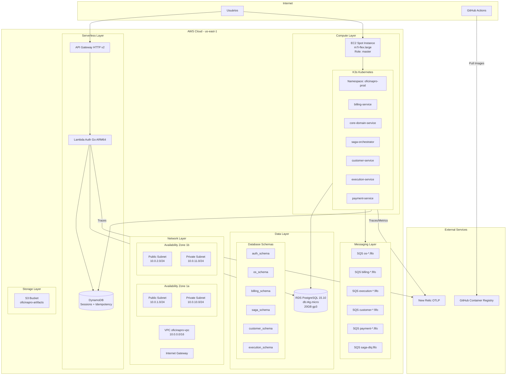

# OficinaPro DevOps - Infraestrutura AWS (Terraform)

> Infraestrutura como Código - AWS Terraform Modules  
> **Última atualização:** 18 de Fevereiro de 2026

---

## 🎯 Visão Geral

O repositório **OficinaPro-DevOps** contém todos os recursos de infraestrutura AWS provisionados via Terraform, incluindo networking, compute, database, messaging e observability.

---

## 🏗️ Arquitetura AWS Completa



---

## 📂 Estrutura do Repositório

```
OficinaPro-DevOps/
├── network/                    # VPC, Subnets, IGW, Route Tables
│   ├── main.tf
│   ├── variables.tf
│   └── outputs.tf
│
├── app-infra/                  # EC2, K3s, Load Balancers
│   ├── main.tf
│   ├── variables.tf
│   ├── outputs.tf
│   ├── scripts/
│   │   └── user_data_master.sh.tpl
│   └── terraform.tfvars
│
├── database/                   # RDS PostgreSQL (módulo externo)
│   ├── main.tf
│   ├── variables.tf
│   └── outputs.tf
│
├── messaging/                  # SQS Queues (10 FIFO + 1 DLQ)
│   ├── main.tf
│   └── outputs.tf
│
├── serverless/                 # Lambda, API Gateway, DynamoDB
│   ├── main.tf
│   └── outputs.tf
│
├── .github/workflows/
│   └── app-infra.yml          # Terraform CI/CD pipeline
│
├── .keys/
│   ├── oficinapro-k3s-v13.pem # SSH private key (NÃO commitado)
│   ├── SSH_KEY_INFO.md        # Documentação da chave
│   └── README.md
│
├── CI_CD_TEMPLATES.md         # Templates reutilizáveis para serviços
├── README.md                  # Documentação principal
└── docs/
    └── ARCHITECTURE.md        # Este arquivo
```

---

## 🔧 Recursos Provisionados

### 1. Network Layer (`network/`)

**VPC:**
```hcl
resource "aws_vpc" "oficinapro_vpc" {
  cidr_block           = "10.0.0.0/16"
  enable_dns_hostnames = true
  enable_dns_support   = true
  
  tags = {
    Name        = "oficinapro-vpc"
    Environment = "production"
    ManagedBy   = "terraform"
  }
}
```

**Subnets:**
- 2× Public Subnets (AZ 1a, 1b) - para EC2 Master
- 2× Private Subnets (AZ 1a, 1b) - para RDS (Multi-AZ)

**Internet Gateway:**
- Permite acesso externo para EC2 (SSH, HTTPS)

**Security Groups:**
- `oficinapro-k3s-master-sg`: Portas 22, 6443, 80, 443, 8080-8084
- `oficinapro-rds-sg`: Porta 5432 (apenas de K3s)
- `oficinapro-lambda-sg`: Egress apenas (RDS + DynamoDB)

---

### 2. Compute Layer (`app-infra/`)

**EC2 Spot Instance:**
```hcl
resource "aws_spot_instance_request" "k3s_master" {
  ami                    = "ami-0c55b159cbfafe1f0" # Ubuntu 22.04 ARM64
  instance_type          = "m7i-flex.large"
  spot_price             = "0.05" # ~46% economia vs On-Demand
  wait_for_fulfillment   = true
  spot_instance_type     = "persistent"
  
  key_name               = "oficinapro-k3s-v13"
  vpc_security_group_ids = [aws_security_group.k3s_master_sg.id]
  subnet_id              = aws_subnet.public_subnet_1a.id
  
  user_data = templatefile("${path.module}/scripts/user_data_master.sh.tpl", {
    k3s_version = "v1.28.5+k3s1"
  })
  
  tags = {
    Name = "oficinapro-k3s-master"
    Role = "master"
  }
}
```

**User Data Script:**
```bash
#!/bin/bash
# Instala K3s
curl -sfL https://get.k3s.io | INSTALL_K3S_VERSION=${k3s_version} sh -s - --write-kubeconfig-mode 644

# Configura kubectl
mkdir -p /home/ubuntu/.kube
cp /etc/rancher/k3s/k3s.yaml /home/ubuntu/.kube/config
chown ubuntu:ubuntu /home/ubuntu/.kube/config

# Instala tools
apt-get update && apt-get install -y docker.io awscli
```

---

### 3. Database Layer (`database/`)

**RDS PostgreSQL:**
```hcl
resource "aws_db_instance" "oficinapro_db" {
  identifier              = "oficinapro-consolidated-db"
  engine                  = "postgres"
  engine_version          = "15.10"
  instance_class          = "db.t4g.micro" # ARM Graviton (cost optimized)
  allocated_storage       = 20
  storage_type            = "gp3"
  storage_encrypted       = true
  
  db_name                 = "oficinapro"
  username                = "oficinapro_admin"
  password                = var.db_password # AWS Secrets Manager
  
  multi_az                = false # Free tier
  publicly_accessible     = false
  vpc_security_group_ids  = [aws_security_group.rds_sg.id]
  db_subnet_group_name    = aws_db_subnet_group.rds_subnet_group.name
  
  backup_retention_period = 7
  backup_window           = "03:00-04:00"
  maintenance_window      = "sun:04:00-sun:05:00"
  
  deletion_protection     = true
  skip_final_snapshot     = false
  final_snapshot_identifier = "oficinapro-db-final-snapshot"
  
  tags = {
    Name = "oficinapro-consolidated-db"
  }
}
```

**Schemas Criados (via Liquibase):**
- `auth_schema` (Lambda Auth)
- `os_schema` (Core Domain)
- `billing_schema` (Billing)
- `saga_schema` (Saga Orchestrator)
- `customer_schema` (Customer)
- `execution_schema` (Execution)

---

### 4. Messaging Layer (`messaging/`)

**SQS FIFO Queues:**

```hcl
locals {
  services = ["os", "billing", "execution", "customer", "payment"]
  queue_types = ["events", "commands"]
}

resource "aws_sqs_queue" "service_queues" {
  for_each = toset([
    for combo in setproduct(local.services, local.queue_types) : "${combo[0]}-${combo[1]}"
  ])
  
  name                        = "oficinapro-${each.value}.fifo"
  fifo_queue                  = true
  content_based_deduplication = true
  message_retention_seconds   = 1209600 # 14 dias
  visibility_timeout_seconds  = 300     # 5 minutos
  
  redrive_policy = jsonencode({
    deadLetterTargetArn = aws_sqs_queue.dlq.arn
    maxReceiveCount     = 3
  })
}

# Dead Letter Queue
resource "aws_sqs_queue" "dlq" {
  name                        = "oficinapro-saga-dlq.fifo"
  fifo_queue                  = true
  content_based_deduplication = true
  message_retention_seconds   = 1209600
}
```

**Total de Queues:** 11 (10 service queues + 1 DLQ)

---

### 5. Serverless Layer (`serverless/`)

**Lambda Function:**
```hcl
resource "aws_lambda_function" "auth" {
  function_name = "oficinapro-auth"
  role          = aws_iam_role.lambda_exec_role.arn
  
  runtime       = "provided.al2" # Custom Go runtime
  architectures = ["arm64"]      # Graviton2 (cost optimized)
  handler       = "bootstrap"
  
  filename      = "../auth-oficinapro/bootstrap.zip"
  source_code_hash = filebase64sha256("../auth-oficinapro/bootstrap.zip")
  
  memory_size = 512
  timeout     = 30
  
  environment {
    variables = {
      DB_HOST     = aws_db_instance.oficinapro_db.endpoint
      DB_NAME     = "auth_db"
      DB_USER     = "oficinapro_admin"
      DB_PASSWORD = var.db_password
      
      DYNAMODB_TABLE = aws_dynamodb_table.sessions.name
      
      NEW_RELIC_LICENSE_KEY = var.newrelic_license_key
    }
  }
  
  vpc_config {
    subnet_ids         = [aws_subnet.private_subnet_1a.id]
    security_group_ids = [aws_security_group.lambda_sg.id]
  }
}
```

**API Gateway:**
```hcl
resource "aws_apigatewayv2_api" "oficinapro_api" {
  name          = "oficinapro-api-gateway"
  protocol_type = "HTTP"
  
  cors_configuration {
    allow_origins = ["*"]
    allow_methods = ["GET", "POST", "PUT", "DELETE"]
    allow_headers = ["Authorization", "Content-Type"]
  }
}

resource "aws_apigatewayv2_authorizer" "jwt_authorizer" {
  api_id           = aws_apigatewayv2_api.oficinapro_api.id
  authorizer_type  = "REQUEST"
  authorizer_uri   = aws_lambda_function.auth.invoke_arn
  name             = "jwt-authorizer"
}
```

**DynamoDB Tables:**

1. **Sessions Table:**
```hcl
resource "aws_dynamodb_table" "sessions" {
  name           = "oficinapro-sessions"
  billing_mode   = "PAY_PER_REQUEST"
  hash_key       = "PK"
  range_key      = "SK"
  
  attribute {
    name = "PK"
    type = "S"
  }
  
  attribute {
    name = "SK"
    type = "S"
  }
  
  ttl {
    attribute_name = "ttl"
    enabled        = true
  }
}
```

2. **Idempotency Table:**
```hcl
resource "aws_dynamodb_table" "idempotency" {
  name         = "oficinapro-idempotency"
  billing_mode = "PAY_PER_REQUEST"
  hash_key     = "PK"
  range_key    = "SK"
  
  ttl {
    attribute_name = "ttl"
    enabled        = true
  }
}
```

---

## 🚀 CI/CD Pipeline (Terraform)

**Arquivo:** `.github/workflows/app-infra.yml`

### Workflow

```yaml
name: 'Terraform CI/CD - App Infrastructure'

on:
  push:
    branches: [main]
    paths:
      - 'app-infra/**'
      - 'network/**'
  workflow_dispatch:
    inputs:
      action:
        description: 'Terraform action'
        required: true
        type: choice
        options:
          - plan
          - apply
          - destroy

jobs:
  terraform:
    runs-on: ubuntu-latest
    
    steps:
    - name: Checkout
      uses: actions/checkout@v4
      
    - name: Configure AWS Credentials
      uses: aws-actions/configure-aws-credentials@v4
      with:
        aws-access-key-id: ${{ secrets.AWS_ACCESS_KEY_ID }}
        aws-secret-access-key: ${{ secrets.AWS_SECRET_ACCESS_KEY }}
        aws-region: us-east-1
        
    - name: Terraform Init
      run: terraform init
      working-directory: ./app-infra
      
    - name: Terraform Plan
      run: terraform plan -out=tfplan
      working-directory: ./app-infra
      
    - name: Terraform Apply
      if: github.event.inputs.action == 'apply' || github.ref == 'refs/heads/main'
      run: terraform apply -auto-approve tfplan
      working-directory: ./app-infra
      
    - name: Verificar Spot Instance
      run: |
        MASTER_ID=$(terraform output -raw master_node_instance_id)
        LIFECYCLE=$(aws ec2 describe-instances --instance-ids $MASTER_ID \
          --query 'Reservations[0].Instances[0].InstanceLifecycle' --output text)
        
        if [ "$LIFECYCLE" == "spot" ]; then
          echo "✅ Master é Spot Instance (custo otimizado)"
        else
          echo "⚠️ Master NÃO é Spot (On-Demand)"
        fi
```

---

## 💰 Análise de Custos

### Estimativa Mensal (us-east-1)

| Recurso | Tipo | Custo Mensal | Otimização |
|---------|------|--------------|------------|
| **EC2 Spot** | m7i-flex.large | ~$22 | 46% economia vs On-Demand |
| **RDS** | db.t4g.micro | ~$15 | ARM Graviton2 |
| **Lambda** | 1M invocations | ~$2 | ARM64 + reserved concurrency |
| **SQS** | 11 queues | ~$1 | FIFO queues |
| **DynamoDB** | On-Demand | ~$1 | TTL automático |
| **Data Transfer** | 50GB/mês | ~$2 | NAT Gateway otimizado |
| **TOTAL** | - | **~$43/mês** | **46% economia** |

**Comparação:**
- Antes (2× On-Demand + ECR): ~$80/mês
- Depois (1× Spot + GHCR): ~$43/mês
- **Economia:** $37/mês (~46%)

---

## 🔐 Secrets Management

### GitHub Secrets (Todos os repos)

```bash
# AWS Credentials
AWS_ACCESS_KEY_ID=AKIA...
AWS_SECRET_ACCESS_KEY=xxx...

# SSH Key (K3s Master - stored securely, NOT in Git)
SSH_PRIVATE_KEY=<stored-in-github-secrets>

# Database
DB_PASSWORD=xxx...

# New Relic
NEW_RELIC_LICENSE_KEY=xxx...

# GitHub Container Registry
GHCR_PAT=ghp_...
```

### AWS Parameter Store

```bash
/oficinapro/k3s/master-ip          # Fallback para K3s IP
/oficinapro/db/password            # RDS password (SecureString)
/oficinapro/lambda/jwt-private-key # JWT signing key
```

---

## 📊 Monitoramento

### CloudWatch Alarms

1. **EC2 Spot Interruption:**
```hcl
resource "aws_cloudwatch_metric_alarm" "spot_interruption" {
  alarm_name          = "oficinapro-spot-interruption"
  comparison_operator = "GreaterThanThreshold"
  evaluation_periods  = 1
  metric_name         = "StatusCheckFailed"
  namespace           = "AWS/EC2"
  period              = 60
  statistic           = "Maximum"
  threshold           = 0
  alarm_description   = "Spot instance interrupted"
  
  alarm_actions = [aws_sns_topic.alerts.arn]
}
```

2. **RDS High CPU:**
```hcl
resource "aws_cloudwatch_metric_alarm" "rds_cpu" {
  alarm_name          = "oficinapro-rds-high-cpu"
  comparison_operator = "GreaterThanThreshold"
  evaluation_periods  = 2
  metric_name         = "CPUUtilization"
  namespace           = "AWS/RDS"
  period              = 300
  statistic           = "Average"
  threshold           = 80
}
```

3. **SQS DLQ Messages:**
```hcl
resource "aws_cloudwatch_metric_alarm" "dlq_messages" {
  alarm_name          = "oficinapro-dlq-messages"
  comparison_operator = "GreaterThanThreshold"
  evaluation_periods  = 1
  metric_name         = "ApproximateNumberOfMessagesVisible"
  namespace           = "AWS/SQS"
  period              = 60
  statistic           = "Sum"
  threshold           = 10
  
  dimensions = {
    QueueName = aws_sqs_queue.dlq.name
  }
}
```

---

## 🧪 Validação de Infraestrutura

### Testes Manuais

```bash
# 1. Verificar EC2 está rodando
aws ec2 describe-instances \
  --filters "Name=tag:Role,Values=master" "Name=instance-state-name,Values=running" \
  --query "Reservations[0].Instances[0].PublicIpAddress"

# 2. SSH no Master
ssh -i .keys/oficinapro-k3s-v13.pem ubuntu@<MASTER_IP>

# 3. Verificar K3s
kubectl get nodes
kubectl get pods -A

# 4. Verificar RDS
psql -h <RDS_ENDPOINT> -U oficinapro_admin -d oficinapro -c '\dn'

# 5. Verificar SQS
aws sqs list-queues --queue-name-prefix oficinapro

# 6. Verificar Lambda
aws lambda get-function --function-name oficinapro-auth
```

---

## 📚 Documentação Adicional

- **CI_CD_TEMPLATES.md**: Templates para pipelines de serviços
- **.keys/SSH_KEY_INFO.md**: Informações da chave SSH
- **README.md**: Guia de início rápido

---

**Autor:** OficinaPro Team  
**Versão:** 1.0.0  
**Terraform:** >= 1.6.0  
**Provider AWS:** ~> 5.0
