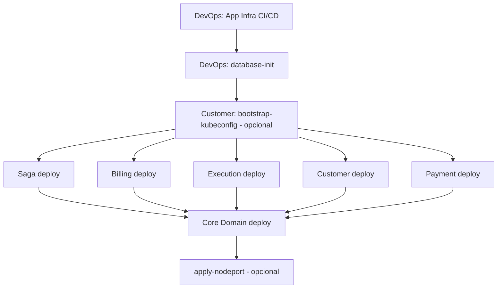

# 📋 Análise de Pipelines CI/CD - Fase 4

> **Data:** 02 de Março de 2026  
> **Contexto:** Recursos AWS zerados - reexecução completa necessária

---

## 1. RESUMO EXECUTIVO

### 1.1 Portas dos Serviços (Mapeamento Oficial)

| Serviço | Porta | Path Health | Registry |
|---------|-------|-------------|----------|
| **core-domain-service** | 8080 | `/api/v1/actuator/health` | GHCR ✅ |
| **billing-service** | 8081 | `/actuator/health` | GHCR ✅ |
| **customer-service** | 8082 | `/actuator/health` | ECR ⚠️ → GHCR |
| **execution-service** | 8083 | `/actuator/health` | GHCR ✅ |
| **saga-orchestrator** | 8084 | `/actuator/health` | GHCR ✅ |
| **payment-service** | 8000 | `/health` | GHCR ✅ |
| **auth-service** | Lambda | N/A | ZIP (Lambda) |

### 1.2 Ordem de Deploy Recomendada (após infra estar pronta)

1. **Infraestrutura** (OficinaPro-DevOps): network → database → messaging → app-infra → auth-infra
2. **Database init** (OficinaPro-Database): schemas e migrations
3. **Bootstrap Kubeconfig** (OficinaPro-Customer): gravar kubeconfig no Parameter Store (se usar deploy via kubectl)
4. **Serviços K8s** (ordem recomendada para dependências):
   - Saga Orchestrator (coordena todos)
   - Billing, Execution, Customer, Payment (paralelo OK)
   - Core Domain (depende de Billing, Execution, Saga, Payment)

---

## 2. PROBLEMAS IDENTIFICADOS

### 2.1 🔴 Customer Service - CRÍTICO

| Problema | Descrição |
|----------|-----------|
| **Registry errado** | Usa **ECR** (Amazon) em vez de **GHCR** (GitHub). Documentação Fase 4 especifica build no GitHub e deploy apenas pull na AWS. |
| **imagePullSecrets** | Usa `ecr-secret`; outros serviços usam `ghcr-secret` |
| **Probes incompletos** | SSM fallback não tem `livenessProbe` e `readinessProbe`; só tem `startupProbe` |
| **startupProbe** | Falta `initialDelaySeconds: 0` no SSM path |

### 2.2 🔴 Payment Service

| Problema | Descrição |
|----------|-----------|
| **IP hardcoded** | Step "Verificar Deployment" usa `${{ env.K3S_PUBLIC_IP }}` (52.73.165.218) em vez de `${{ steps.infra.outputs.master_ip }}` |
| **IMAGE_OWNER** | Não usa lowercase para GHCR (ghcr.io requer lowercase) |
| **Variáveis obsoletas** | `K3S_INSTANCE_ID` e `K3S_PUBLIC_IP` hardcoded no env |

### 2.3 🟡 Core Domain Service

| Problema | Descrição |
|----------|-----------|
| **URLs Feign faltando** | ConfigMap não define `BILLING_SERVICE_URL`, `EXECUTION_SERVICE_URL`, `SAGA_ORCHESTRATOR_URL`, `PAYMENT_SERVICE_URL` |
| **Portas erradas no default** | application.properties usa execution:8082 (deveria ser 8083) e payment:8080 (deveria ser 8000) |
| **SSH timeout** | `timeout: 60s` no ssh-action pode ser curto para deploy completo |

### 2.4 🟡 Apply NodePort (DevOps)

| Problema | Descrição |
|----------|-----------|
| **IP hardcoded** | Usa `44.214.64.63` diretamente; após zerar recursos o IP mudará |
| **Sem busca dinâmica** | Não busca o IP do K3s Master via AWS |

### 2.5 🟡 Startup/Health - Tempo de PE (Pending)

| Serviço | startupProbe | Tempo máx até healthy |
|---------|--------------|------------------------|
| Todos | failureThreshold: 30, periodSeconds: 10 | 300s (5 min) |
| Customer (SSM) | idem | OK |
| **Recomendação** | Adicionar `initialDelaySeconds: 0` onde faltar | Garante que probes começam imediatamente |

O `failureThreshold: 30` com `periodSeconds: 10` = até 300s para o pod ficar Ready. Java/Spring podem levar 60-90s para subir. Se passar de 300s, o K8s marca como Failed e reinicia.

**Sugestão:** Aumentar para `failureThreshold: 36` (6 min) em serviços que fazem Liquibase/migrations pesadas na primeira subida.

### 2.6 🟢 Conectividade entre Serviços

| Origem | Destino | URL esperada (K8s DNS) | Status |
|--------|---------|-------------------------|--------|
| Core Domain | Billing | `http://billing-service.oficinapro-prod.svc.cluster.local:8081` | ⚠️ Precisa ConfigMap |
| Core Domain | Execution | `http://execution-service.oficinapro-prod.svc.cluster.local:8083` | ⚠️ Precisa ConfigMap |
| Core Domain | Saga | `http://saga-orchestrator.oficinapro-prod.svc.cluster.local:8084` | ⚠️ Precisa ConfigMap |
| Core Domain | Payment | `http://payment-service.oficinapro-prod.svc.cluster.local:8000` | ⚠️ Precisa ConfigMap |
| Saga | SQS | Via AWS SDK + Queue URLs | ✅ ConfigMap tem |
| Todos | RDS | Via endpoint dinâmico | ✅ OK |

---

## 3. CHECKLIST PRÉ-DEPLOY (Recursos Zerados)

### 3.1 Infraestrutura AWS

- [ ] VPC, subnets, security groups
- [ ] EC2 K3s Master (tag Role=master ou Name=*k3s*)
- [ ] RDS oficinapro-consolidated-db
- [ ] SQS queues (oficinapro-*-optimized)
- [ ] Lambda oficinapro-auth-function-fase4
- [ ] API Gateway oficinapro-auth-api-fase4
- [ ] SSM Parameter /oficinapro/k3s/kubeconfig (opcional; ou rodar Bootstrap)
- [ ] SSM Parameter /oficinapro/k3s/master-ip (fallback)

### 3.2 GitHub Secrets (todos os repositórios)

```
AWS_ACCESS_KEY_ID
AWS_SECRET_ACCESS_KEY
SSH_PRIVATE_KEY        # Chave para EC2 K3s
DB_PASSWORD            # RDS
NEW_RELIC_LICENSE_KEY
GHCR_PAT               # GitHub Personal Access Token com read:packages
JWT_SECRET             # Auth Lambda
MP_TOKEN               # Payment (Mercado Pago) - OficinaPro-Payments
```

### 3.3 Registry de Imagens

- **Padrão Fase 4:** Build no **GitHub Actions** → Push para **GHCR** → K8s faz `imagePull` do GHCR
- **NÃO** buildar imagem na EC2; apenas `kubectl apply` com imagem já no GHCR

---

## 4. SQS QUEUE NAMES (Fase 4 - Optimized)

Todas as pipelines buscam filas com sufixo `-optimized`:

| Serviço | Events | Commands | DLQ |
|---------|--------|----------|-----|
| OS | oficinapro-os-events-optimized | oficinapro-os-commands-optimized | - |
| Billing | oficinapro-billing-events-optimized | oficinapro-billing-commands-optimized | oficinapro-saga-dlq-optimized |
| Execution | oficinapro-execution-events-optimized | oficinapro-execution-commands-optimized | - |
| Customer | oficinapro-customer-events-optimized | oficinapro-customer-commands-optimized | - |
| Payment | oficinapro-payment-events-optimized | - | - |

**Nota:** Terraform/messaging layer deve criar essas filas. Verificar nomes no módulo de messaging.

---

## 5. ORDEM DE EXECUÇÃO DAS WORKFLOWS

**Sequência atual (recursos já criados):**

```
1. App Infra CI/CD (databases + messaging + compute)
       ↓ (dispara automaticamente quando success)
2. Database Init (cria customer_db, billing_db, execution_db, saga_db, payment_db)
       ↓ (manual: Bootstrap Kubeconfig - recomendado para evitar SSH)
3. Deploy serviços: saga, billing, execution, customer, payment
       ↓
4. Core Domain deploy
       ↓
5. apply-nodeport (opcional)
```

**Database Init** – 3 métodos (em ordem de prioridade):
1. **kubectl** – Se kubeconfig estiver no Parameter Store (rodar Bootstrap antes)
2. **SSM** – Se a instância K3s tiver SSM Agent e IAM (não usa porta 22)
3. **SSH** – Fallback (usa porta 22; pode dar timeout se Security Group bloquear)



---

## 6. AÇÕES CORRETIVAS IMPLEMENTADAS

1. **Customer:** Migrar ECR → GHCR; adicionar liveness/readiness no manifest SSM; padronizar imagePullSecrets
2. **Payment:** Corrigir Verificar Deployment para usar `steps.infra.outputs.master_ip`; adicionar IMAGE_OWNER lowercase; remover vars hardcoded
3. **Core Domain:** Adicionar ao ConfigMap as URLs dos serviços (Billing, Execution, Saga, Payment) para Feign
4. **apply-nodeport:** Buscar IP dinamicamente via AWS
5. **Probes:** Garantir initialDelaySeconds: 0 em startupProbe onde faltar; revisar failureThreshold para apps com migrations

---

**Autor:** Análise automatizada - OficinaPro Team  
**Versão:** 1.0
